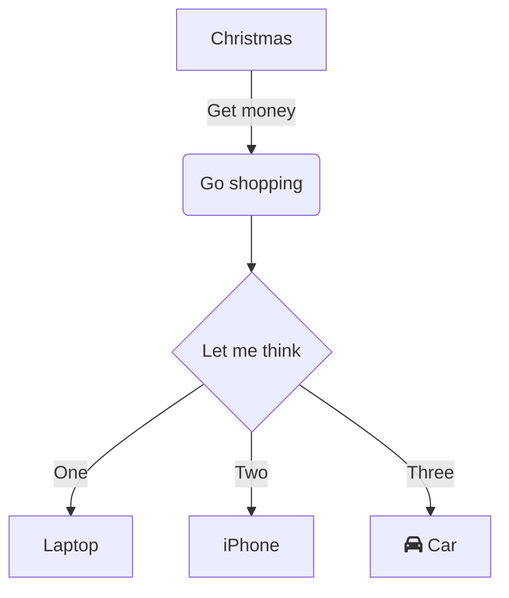
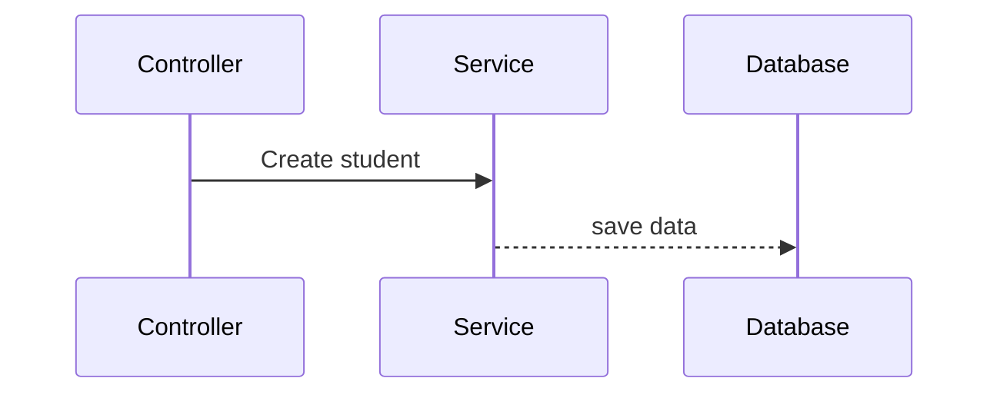

# Backend proyecto

A brief description of what this project does and who it's for


## Autores

- [@octokatherine](https://www.github.com/octokatherine)
- [@octokatherine](https://www.github.com/octokatherine)
- [@octokatherine](https://www.github.com/octokatherine)
- [@octokatherine](https://www.github.com/octokatherine)
- [@octokatherine](https://www.github.com/octokatherine)


## Badges

Add badges from somewhere like: [shields.io](https://shields.io/)

[](https://choosealicense.com/licenses/mit/)
[](https://opensource.org/licenses/)
[](http://www.gnu.org/licenses/agpl-3.0)


## Contributing

Contributions are always welcome!

See `contributing.md` for ways to get started.

Please adhere to this project's `code of conduct`.


## Appendix

Any additional information goes here


## Requerimientos

1. Tener docker instalado
2. Postgres 16+
## Roadmap

- Additional browser support

- Add more integrations


## Support

For support, email fake@fake.com or join our Slack channel.


## Running Tests

To run tests, run the following command

```bash
  npm run test
```


## Used By

This project is used by the following companies:

- Company 1
- Company 2


## Tech Stack

**Client:** React, Redux, TailwindCSS

**Server:** Node, Express


## Run Locally

Clone the project

```bash
  git clone ...
```



# Diagramas

